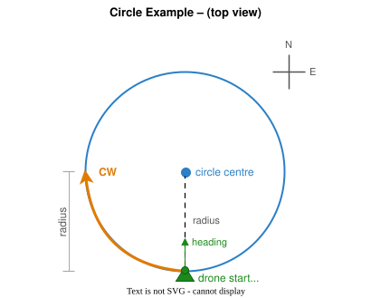

# Circle example

This example will make the Vertex fly in a circle. The example showcases how to use the SDK to fly a circle with the drone that is already airborne. It will use its current position to start flying in circles. The radius and speed can be changed using CLI arguments.

> **Pre-condition:** The drone must be hovering stably in the air in **SDK mode** before activating this example.

## Structure

The code is split up into multiple parts:

- [RemoteController](../common/include/common/remote_controller_interface.hpp): Interprets the raw controller data and triggers an action callback.
- [DroneState](../common/include/common/drone_state_interface.hpp): Collects the state and position of the drone.
- [CircleReferences](src/circle_references.hpp): Class that calculates the setpoints for the drone to fly in a circle.
- [Main](src/main.cpp): Main sets up all the classes and runs the main loop.

## Circle geometry

The circle centre is placed directly in front of the drone (in the direction it is facing) at a distance equal to the configured radius. The drone starts at its current position (the rear-most point of the circle) and flies **clockwise** when viewed from above. Altitude and heading remain constant throughout the manoeuvre.



## CircleReferences

This class is responsible for calculating the setpoints for the drone to fly in a circle. It uses the current position of the drone to calculate the setpoints. The radius and the execution time can be changed in the code.
Based on the spin rate of the example, the setpoints are calculated and a new setpoint is returned upon every call to `GetNewStateReference`. The drone will only change position in the horizontal plane. The altitude and heading will remain the same.

## Main

The main function sets up all the classes and runs the main loop. It will take care of the CLI arguments and will subscribe to the correct API's and register the correct callbacks.

The execution of the example can be toggled using the D button (SF switch when using Jeti Controller). Once the execution is active, the drone must already be flying in **SDK mode** (referred to as `user` control mode in the API). If the drone is not airborne when the execution is activated, the execution will stop immediately and the reason will be reported.

### Taking over manual control

To take over control manually at any time, switch out of **SDK** mode by pressing the **mode switch button**. This causes the drone to stop following the SDK setpoints immediately, and the circle execution is stopped automatically. To restart the circle from the new position, switch back to SDK mode and press **example activation button**.

### Starting and stopping the example

| Action | Effect |
|--------|--------|
| Press **example activation button** (execution inactive) | Activates the circle. The circle starts from the drone's current position and heading. |
| Press **example activation button** (execution active) | Stops the circle. The drone holds its current position. Press **example activation button** again to restart from the current position. |
| Switch out of **SDK** mode | Immediately stops the circle execution and returns manual control. Switch back to SDK mode and press **example activation button** to restart. |

## Usage

The example can be executed by running the following command:

```bash
./build/bin/circle_example
```

The following CLI arguments can be used:

- `--verbose`: Enable verbose output.
- `--radius`: Radius of the circle in meters. Default is 2 meters.
- `--speed`: Speed of the drone in meters per second. Default is 0.5 m/s.
- `--accel`: Maximum acceleration of the drone in metres per second squared. Default is 1.0 m/s^2.
- `--frequency`: Update frequency in Hz. Default is 100 Hz.
- `--jeti`: Use Jeti controller. Default is Herelink.

> **Note:** The valid range for `circle_radius`, `speed`, and `accel` is determined by the drone's parameter configuration and its flight limits. See the [flight controller parameters](https://avular-robotics.github.io/vertex_one_user_documentation/latest/flight_controller/parameters.html) for the limits and defaults.

Example:

```bash
./build/bin/circle_example --radius 3 --speed 1 --accel 3
```

The example can be stopped by pressing `Ctrl + C`.
