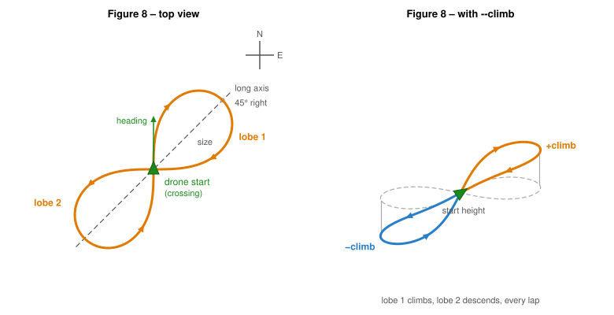

# Figure 8 example

This example will make the Vertex fly a figure 8. Like the [circle example](../circle_example/README.md), it showcases how to use the SDK to fly a pattern with a drone that is already airborne. It will use its current position and heading to start flying figure 8s. The size, speed, climb and heading behaviour can be changed using CLI arguments.

> **Pre-condition:** The drone must be hovering stably in the air in **SDK mode** before activating this example.

## Structure

The code is split up into multiple parts:

- [RemoteController](../common/include/common/remote_controller_interface.hpp): Interprets the raw controller data and triggers an action callback.
- [DroneState](../common/include/common/drone_state_interface.hpp): Collects the state and position of the drone.
- [Figure8References](src/figure8_references.hpp): Class that calculates the setpoints for the drone to fly a figure 8.
- [Main](src/main.cpp): Main sets up all the classes and runs the main loop.

## Figure 8 geometry

The figure 8 is a lemniscate of Bernoulli. The drone starts at its current position, which is the crossing of the figure 8, and flies **straight ahead** (in the direction it is facing). The long axis of the figure 8 points 45 degrees to the right of that heading, so the drone curves to the right into the first lobe. The figure 8 is `2 * size` long along its long axis and `0.7 * size` wide.



Its curvature grows from zero at the crossing to its peak at the tips, so the bank builds up smoothly from level and is largest at the tips. The drone never stops, it is banked most of the time, and with `--climb` the thrust changes while it is banked.

## Figure8References

This class is responsible for calculating the setpoints for the drone to fly a figure 8. It uses the current position and heading of the drone to place the figure 8. Every call to `GetNewStateReference` returns the next setpoint: the position, with the velocity and acceleration as feedforward.

The curve angle follows the same law in time as the circle example: it speeds up smoothly from rest until the drone flies `--speed` at the tips, where the figure 8 is sharpest. Through the crossing the speed is 0.71 of that. The acceleration at the tips is `3 * speed^2 / size`; when that is above `--accel` the speed is lowered to fit, as in the circle example.

With `--climb` the height goes up by `climb` over the first lobe and down by `climb` over the second, every lap, around the start height. With `--frontal` the nose turns along the path; otherwise the heading stays the initial heading.

### Waiting for the drone

The setpoint is a function of time, so on its own it would keep moving along the figure 8 even when the drone falls behind (for example in wind, or at the drone's speed limits). The gap would grow and the drone would cut across to catch up. To prevent this, `GetNewStateReference` takes the drone's current position and slows down the time of the reference when the drone lags:

- Closer than 0.3 m (`kFullSpeedErrorM`): the reference moves at full speed.
- Further than 1.0 m (`kStopErrorM`): the reference waits for the drone.
- In between: the reference slows down linearly.

The time scale changes gradually so the setpoint does not jerk. Because the velocity and acceleration feedforward are derivatives in time, they are scaled with it (velocity by the time scale, acceleration by its square). The drone always flies the full path, only slower where it cannot keep up. With `--verbose` the time scale is printed with every setpoint.

## Main

The main function sets up all the classes and runs the main loop. It will take care of the CLI arguments and will subscribe to the correct API's and register the correct callbacks.

The execution of the example can be toggled using the D button (SF switch when using Jeti Controller). Once the execution is active, the drone must already be flying in **SDK mode** (referred to as `user` control mode in the API). If the drone is not airborne when the execution is activated, the execution will stop immediately and the reason will be reported.

### Taking over manual control

To take over control manually at any time, switch out of **SDK** mode by pressing the **mode switch button**. This causes the drone to stop following the SDK setpoints immediately, and the figure 8 execution is stopped automatically. To restart the figure 8 from the new position, switch back to SDK mode and press **example activation button**.

### Starting and stopping the example

| Action | Effect |
|--------|--------|
| Press **example activation button** (execution inactive) | Activates the figure 8. The figure 8 starts from the drone's current position and heading. |
| Press **example activation button** (execution active) | Stops the figure 8. The drone holds its current position. Press **example activation button** again to restart from the current position. |
| Switch out of **SDK** mode | Immediately stops the figure 8 execution and returns manual control. Switch back to SDK mode and press **example activation button** to restart. |

## Usage

The example can be executed by running the following command:

```bash
./build/bin/figure8_example
```

The following CLI arguments can be used:

- `--verbose`: Enable verbose output.
- `--size`: Half the length of the figure 8 in meters. Default is 2 meters.
- `--speed`: Speed of the drone at the tips in meters per second. Default is 0.5 m/s.
- `--accel`: Maximum acceleration of the drone in metres per second squared. Default is 1.0 m/s^2.
- `--climb`: Height to climb over the first lobe and descend over the second, in meters. Default is 0 meters.
- `--frontal`: Turn the nose along the path instead of holding the initial heading.
- `--frequency`: Update frequency in Hz. Default is 100 Hz.
- `--jeti`: Use Jeti controller. Default is Herelink.

> **Note:** The valid range for `size`, `speed`, and `accel` is determined by the drone's parameter configuration and its flight limits. See the [flight controller parameters](https://avular-robotics.github.io/vertex_one_user_documentation/latest/flight_controller/parameters.html) for the limits and defaults.

Example:

```bash
./build/bin/figure8_example --size 5 --speed 1 --accel 1 --climb 1 --frontal
```

The example can be stopped by pressing `Ctrl + C`.
