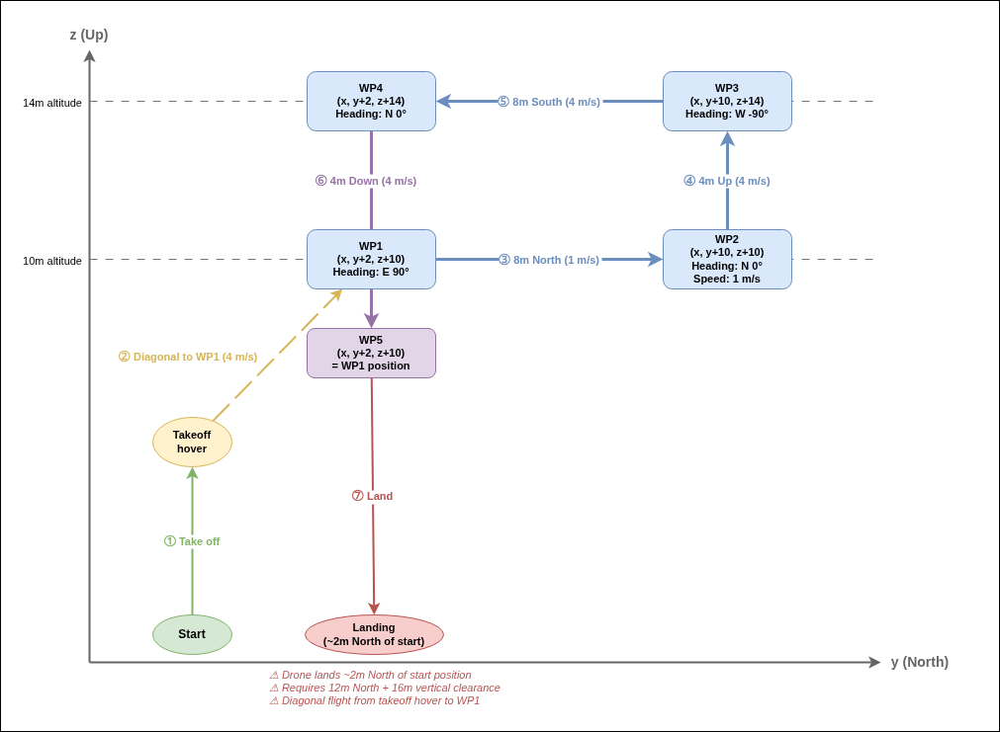

# Waypoint example

The example showcases how to use the CreOS SDK Job API to create a mission that will automatically take off, fly through a series of waypoints, and land. The mission uses waypoint tasks with custom heading and speed settings.

## Mission description

The drone flies a **vertical rectangle** in the North-Up plane (no East-West movement). All coordinates are in the LTP frame (ENU: x=East, y=North, z=Up), relative to the drone's position when execution is activated. The job speed is set to **4 m/s** unless overridden per waypoint.

 

The full sequence is:

1. **Take off** — The drone lifts off from the current position and climbs to the configured takeoff height (set in the drone's settings).
2. **WP1** (x, y+2, z+10) — Fly diagonally to 2m North, 10m altitude. Heading: East (90°). Speed: 4 m/s.
3. **WP2** (x, y+10, z+10) — Fly 8m North (to 10m total). Heading: North (0°). Speed: **1 m/s** (overridden).
4. **WP3** (x, y+10, z+14) — Climb 4m to 14m altitude. Heading: West (-90°). Speed: 4 m/s.
5. **WP4** (x, y+2, z+14) — Fly 8m South (back to 2m North offset). Heading: North (0°). Speed: 4 m/s.
6. **WP5** (x, y+2, z+10) — Descend 4m back to WP1 position (10m altitude). Speed: 4 m/s.
7. **Land** — The drone descends and lands at its current position, approximately **2m North** of the original starting position.

### Clearance requirements

- **North:** at least **12m** of clearance from the starting position.
- **Vertical:** at least **16m** of clearance above the ground (14m waypoint altitude + margin).
- **East/West:** minimal clearance needed (no lateral movement).

> **Caution:** The drone does **not** return to its original starting position. It lands approximately **2m North** of where it took off. Ensure the landing area at that offset is clear and level.

> **Caution:** The waypoints are computed relative to the drone's position at the moment execution is activated (D button press), not at program start. Make sure the drone is in a safe, known position before activating.

> **Caution:** After takeoff the drone hovers at the configured takeoff height, then flies **diagonally** to WP1 (2m North, 10m altitude) from the starting position. Meaning if Job is started when the drone is already in the air, the initial position for the waypoints will be that in-air position, not the ground takeoff position. So if the Job is started at 5m altitude, WP1 will be at 15m altitude (5m + 10m, so not 10m). Always ensure the drone's position at Job activation is suitable for the planned waypoints.

## Structure

The code is split up into multiple parts:

- [RemoteController](../common/include/common/remote_controller_interface.hpp): Interprets the raw controller data and triggers an action callback.
- [DroneState](../common/include/common/drone_state_interface.hpp): Collects the state and position of the drone.
- [Main](src/main.cpp): Main sets up all the classes and runs the main loop.

## Main

The main function sets up all the classes and runs the main loop. It will take care of the CLI arguments and will subscribe to the correct API's and register the correct callbacks.

The execution of the example can be toggled using the D button (SF switch when using Jeti Controller). Once the execution is active, a job is created based on the current drone position. As the mission progresses, the `reportJobStatus` function tracks and logs the completion of each task.

## Usage

The example can be executed by running the following command:

```bash
./build/bin/waypoint_example
```

The following CLI arguments can be used:

- `--verbose`: Enable verbose output.
- `--frequency`: Update frequency in Hz. Default is 100 Hz.
- `--job`: Select which job to run.
- `--jeti`: Use Jeti controller instead of Herelink controller.
- `--host`: Hostname and port of the CREOS agent.

Example:

```bash
./build/bin/waypoint_example --jeti
```
